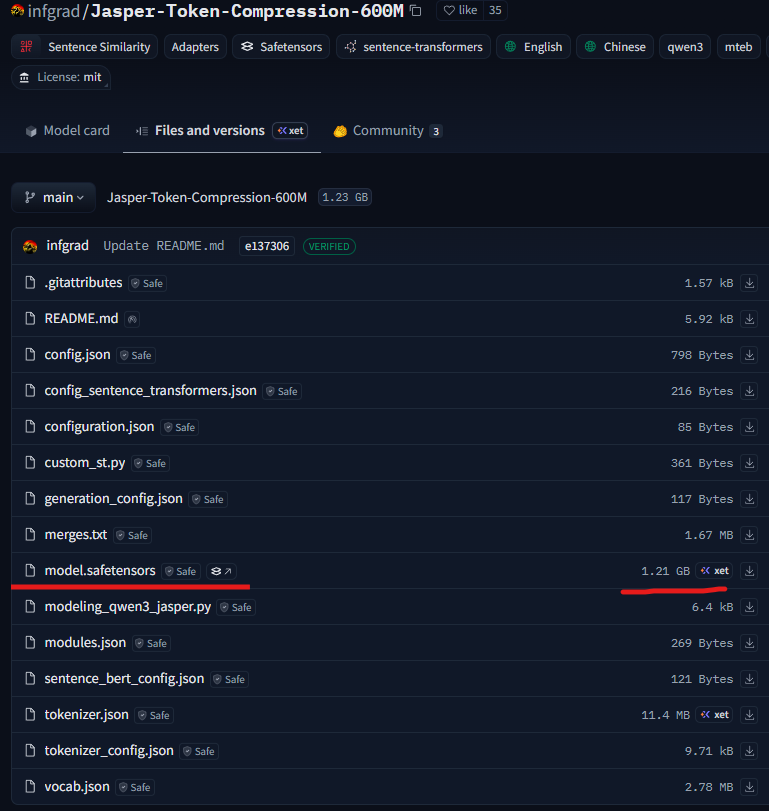
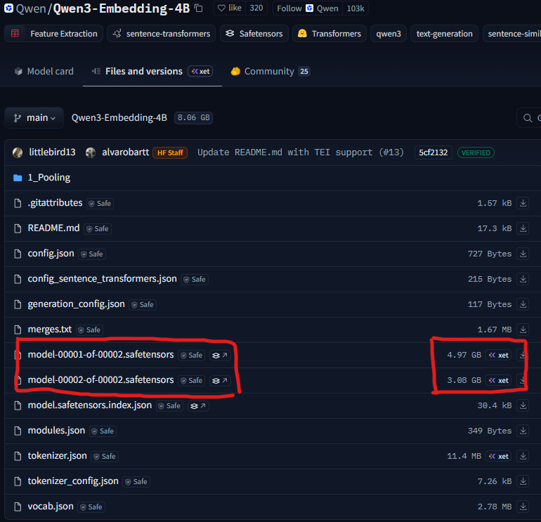

### 详细配置过程

```
conda create -n rag python==3.9
pip install torch torchvision torchaudio --index-url https://download.pytorch.org/whl/cu121
pip install transformers==4.51.3
pip install langchain==0.3.27 langchain-community==0.3.29 langchain-huggingface==0.3.1 sentence-transformers==5.1.0 faiss-cpu==1.11.0
pip install docling
pip install jieba
pip install rank-bm25
```

项目目标：能在常见游戏本、中端主机上部署的RAG知识库

> 模型都是在huggingface上获取的，需要魔法，不用在仓库中手动下载，运行时会自动下载所需要权重文件
>
> 下面是一个embedding模型测评网页[MTEB Leaderboard - a Hugging Fac](https://huggingface.co/spaces/mteb/leaderboard)


**embedding小模型对比，截至2026.9.9**

| 模型                                                         | 参数量 | 最低显存约占用 | 中文排名 | 英文排名 | 多语言排名 |
| ------------------------------------------------------------ | ------ | -------------- | -------- | -------- | ---------- |
| [ Qwen/Qwen3-Embedding-4B](https://mteb-leaderboard.hf.space/models/Qwen/Qwen3-Embedding-4B) | 3B     | 14.5GB         | 14       | 7        | 6          |
| [ infgrad/Jasper-Token-Compression-600M](https://mteb-leaderboard.hf.space/models/infgrad/Jasper-Token-Compression-600M) | 607M   | 1.2GB          | 9        | 2        | 194        |
| [ tencent/Youtu-Embedding](https://mteb-leaderboard.hf.space/models/tencent/Youtu-Embedding) | 2.7B   | 9.6GB          | 2        | -        | 400        |


> 可以看到，尽管前两个模型的参数量不大，但是占用的显存远超预期，而且是参数量的整数倍（2倍或4倍，与参数的数据类型有关），实际可以根据主要权重文件的大小估计最少占用的显存大小（如下图所示），实际中为了快速向量化需要并发增加batchsize大小，还要预留一些显存预算
>






> 重排模型选用 BAAI/bge-reranker-v2-m3，参数量0.6B，占用显存约2.3GB，模型地址：[BAAI/bge-reranker-v2-m3 · Hugging Face](https://huggingface.co/BAAI/bge-reranker-v2-m3)
>

